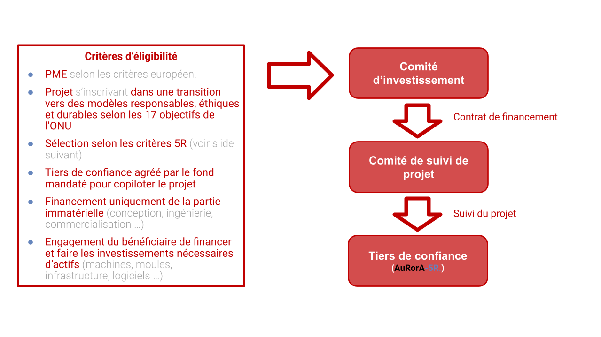
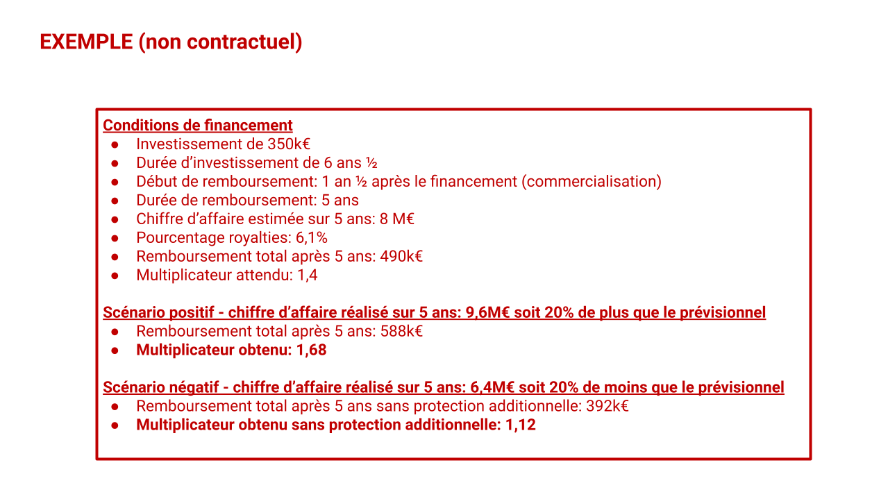
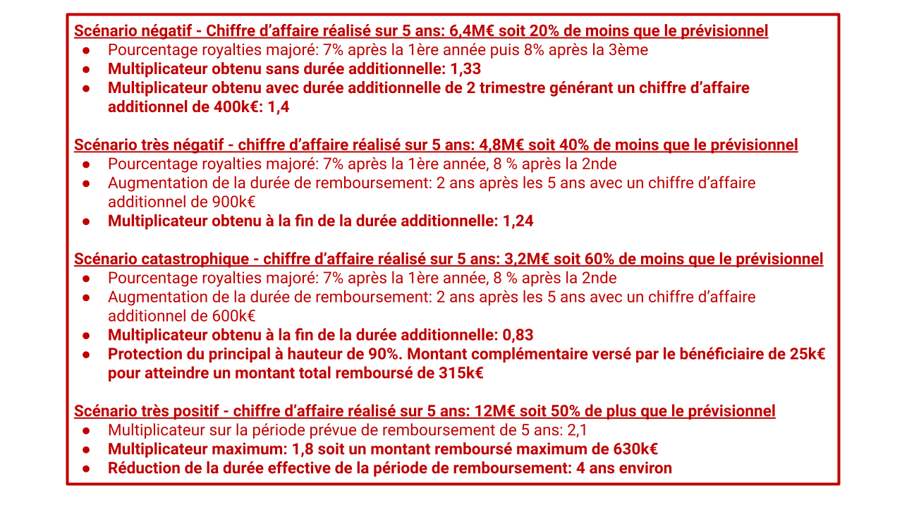

---

title: Time4𝝻r-kids.

question : Fonds d’investissement en royalties pour la transition des PMEs 

parent: Nos actions

---

Pourquoi avez-vous identifié le besoin de créer un tel fonds ?
--------------------------------------------------------------

Lancer un projet de transition requiert trois ingrédients principaux: un porteur décidé à s’engager, des compétences appropriées et enfin des moyens financiers. Les start-ups bénéficient de l’appétit des fonds d’innovation et d’investissements, avec la possibilité de faire des levées importantes sur la base non pas de leur profitabilité actuelle mais de la promesse de succès dans le futur. Les ETIs ou grands groupes ont des équipes dédiées et des liens avec le milieu financier leur permettant de trouver les moyens adéquats et de répartir leurs risques.

Les PMEs, elles, ont plus de difficultés à trouver des outils leur permettant de se financer tout en gérant le profil de risques de leur investissement. Et pourtant, de par sa surface financière plus limitée, la question du risque liée à un investissement est un sujet qui peut s’avérer critique pour une PME, et freiner sa capacité d’innovation. C’est une décision difficile que de se lancer dans un projet, qui s’il ne réussit pas, peut mettre en péril son activité principale ou oblitérer.

Time4𝝻r-kids. fonds d’investissement en royalties, souhaite apporter une réponse à ce problème, en proposant un financement des projets de transition qui intègre une partie de la prise de risque du projet dans son remboursement.

A quelle étape de la constitution du fonds êtes-vous ?
------------------------------------------------------

Nous sommes encore au stade de la création du fonds et certains principes et détails restent à fixer. Les informations ci-dessous sont donc préliminaires et peuvent encore évoluer d’ici le lancement effectif. Nous souhaitons pouvoir l’ouvrir aux investisseurs dans le courant du deuxième trimestre 2021.

Que finance-t-il ?
------------------

Time4𝝻r-kids.  a pour objectif de financer ou cofinancer de 8 à 15 projets de transition pour des montants allant de 100 000 euros jusqu’à un maximum de 500 000 euros. Le financement porte sur les actifs immatériels (compétences, sous-traitance pour la conception, prototypage, ….) requis pour la réalisation des projets de transition jusqu’à leur commercialisation. Ces projets doivent être portés par des PMEs et répondre à des critères précis de réalisation et de responsabilité nommés 5R.

Quel est son profil de risque ?
-------------------------------

Un fonds d’investissement en royalties est une dette conditionnée, avec un profil de risque situé entre celui d’une dette classique et celle d’un investissement en capital. Le rendement , matérialisé par un multiplicateur, est conditionné à la performance du projet. Le remboursement est fait sur la base d’un pourcentage du chiffre d’affaires (les royalties), suite à la commercialisation du projet, sur une durée définie. Le pourcentage et la durée sont contractualisés à l’octroi du financement sur la base d’un multiplicateur attendu et d’un chiffre d’affaires jugé réaliste, supporté par des études de marché et validé par le comité d’investissement.

Des conditions additionnelles sont prévues afin de réduire l’exposition au risque:

* en cas de sous performance, le pourcentage de royalties peut être ajusté à la hausse dans une fourchette prédéterminée tout au long de la période de remboursement.
* en cas de sous performance à la fin de la période de remboursement, celle-ci peut être prorogée dans une fourchette de temps prédéterminée.
* en cas de très forte sous performance, le bénéficiaire du financement s’engage à rembourser un montant complémentaire, sans condition de périmètre ou de performance, afin d’assurer le recouvrement d’un pourcentage du montant investi. Nos hypothèses de travail à ce stade positionnent ce plancher autour de 90% soit un multiplicateur minimum de 0,9.

En échange de ces protections additionnelles pour les investisseurs, il est fixé un multiplicateur maximum au-delà duquel les remboursements cessent.

Comme toute dette, le risque de perte totale en capital existe, malgré les protections listées ci-dessus, dans le cas d’une faillite du bénéficiaire.

Le fonds investissant sur plusieurs projets, le rendement obtenu par les investisseurs est l’agrégation de la performance de tous les projets. Le profil de risque du fonds est donc moindre que celui de chaque investissement pris individuellement.

Comment vous assurez-vous de la performance du projet?
------------------------------------------------------

La performance du projet dépend de:

* sa bonne réalisation, nécessitant les compétences, moyens et méthodes idoines,
* la réalisation d’investissements complémentaires à réaliser par le bénéficiaire (actifs industriels de type machine, achat de matières premières, embauches …),
* la production et commercialisation durant la période de remboursement.

Pour maximiser les chances de succès du projet, le fonds s’appuie sur des sociétés qu’il certifie, la première étant A𝝻RorA-5R.  , qui ont un double rôle:

* tiers de confiance pour le fonds jusqu’à la fin de la période de remboursement
* accompagnement du bénéficiaire tout au long du projet et éventuellement de son exploitation

La prestation d’accompagnement du bénéficiaire tout au long du projet et de son exploitation est l’objet d’un contrat entre le bénéficiaire et la société et budgété par le bénéficiaire dans son coût de projet. Ce coût peut être totalement ou partiellement couvert par le financement apporté par le fonds.

Le bénéficiaire s’engage contractuellement à faire les investissements nécessaires pour la montée en production, la commercialisation et l’exploitation du projet dans le cadre d’un périmètre budgétaire prédéfini et ceci jusqu’à la fin de la période de remboursement.

Dans le cas où le bénéficiaire manquait à cette obligation ou à toute autre obligation pouvant impacter la performance du projet ou de l’investissement, une clause de résiliation peut être activée par le fonds, transformant alors le financement en dette avec un taux et durée prédéterminés.

