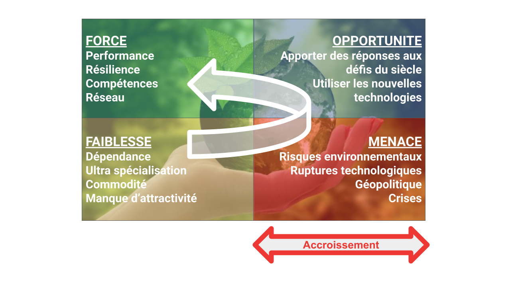
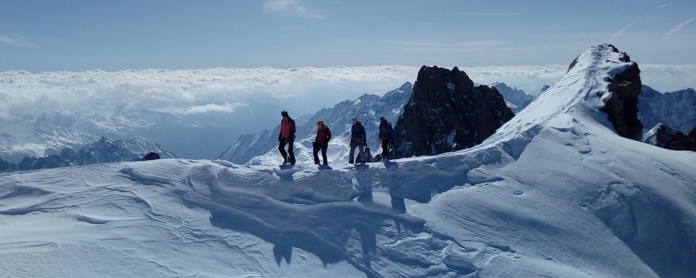
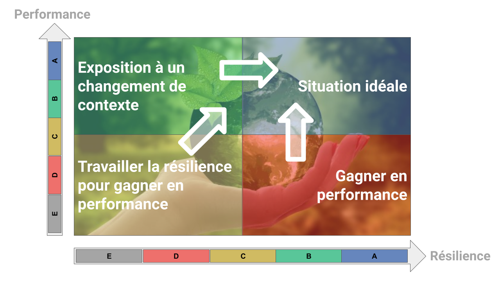
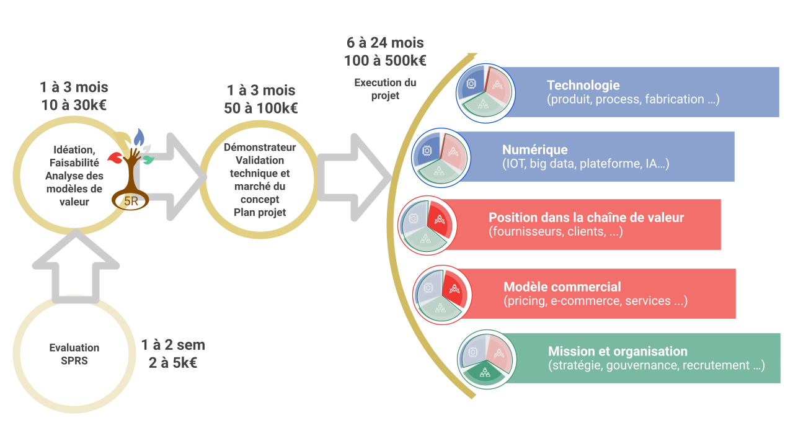

Avant de répondre à la question de pourquoi nous choisir pour vous accompagner sur des sujets aussi stratégiques que des projets de transition de votre entreprise, il est important de partager quelques éléments structurants.

Qu’est que vous appelez transition?
-----------------------------------

Une transition est un changement d’état, si possible souhaité mais parfois subi ou obligé. La vie d’une entreprise est jalonnée par ces successions de transitions; changement de dirigeant, acquisition, nouvelle technologie, mutation du marché, crise …

Nous nommons projet de transition la mise en place de solutions et de modèles permettant de conjuguer performance de l’entreprise et de son écosystème avec sa résilience et sa responsabilité sociale et environnementale. Trop souvent, la notion de responsabilité sociale et environnementale est perçue comme une contrainte, antinomique avec les objectifs économiques de l’entreprise. Certes, cela amène des contraintes qui peuvent être fortes. C’est aussi source d’innovation et de créativité, avec à terme un positionnement renforcé de l’entreprise au sein de sa filière.([Agir Autrement](https://www.google.com/url?q=https://aurora-5r.fr/offres/AgirAutrement/&sa=D&source=editors&ust=1614003504347000&usg=AOvVaw1mRF1RmjanBnvsFBkRNONe)).

Chaque société a un point de départ différent et un cheminement propre selon sa filière, ses hommes, son historique, ses idées et ambitions … Notre vocation est de les guider et les seconder dans la préparation et l’accomplissement de cette voie vers de nouveaux horizons et sommets.

Pourquoi se lancer dans un projet de transition?
------------------------------------------------

Un projet de transition a pour double objectif de renforcer la société au sein de sa filière et de faire évoluer celle-ci vers des modèles plus résilients et responsables. Il peut prendre différentes formes, lancement de nouveau produit, intégration de solutions numériques dans des solutions existantes, nouveau positionnement dans la chaîne de valeur, transformation du modèle commercial, diversification.

Dans le contexte actuel, il peut être difficile de se projeter et de voir un tel projet comme priorité. Et pourtant, il permet de mobiliser positivement les énergies, de mettre en action les personnes et la société autour d’un objectif important pour son développement et sa résilience.

A𝝻RorA-5R., guide de « transition », vous accompagne tout au long de votre parcours de transition
-------------------------------------------------------------------------------------------------

Probablement de par notre localisation et notre amour pour la montagne, nous aimons souvent faire le parallèle, toute proportion gardée, entre le rôle d’A𝝻RorA-5R. et celui des guides menant les expéditions en haute montagne.

En montagne, chaque course est différente. Quand il s’agit d’atteindre des sommets difficiles et parfois inconnus, faire appel à un guide est souvent un choix judicieux. Ce dernier apporte une vraie valeur ajoutée en:

1. Faisant une évaluation du niveau actuel de la cordée et de ses capacités - le SPRS dans notre jargon. 
2. Sélectionnant la course appropriée en fonction des souhaits du chef de cordée et des capacités de cette dernière. - c’est ce que nous appelons l’IFA.
3. Préparant la course avec la cordée; son tracé, les points d’étapes, les ressources et équipements nécessaires, les itinéraires de repli en cas d’adversité, l’identification des risques éventuels - cette étape est appelée DVP.
4. Guidant la cordée tout au long du cheminement en secondant le chef de cordée et chacun de ses membres en apportant les méthodes, outils et compétences nécessaires tout en anticipant et en apportant les savoir - faire face aux imprévus, quitte à modifier le parcours pour atteindre l’objectif - c’est la phase de réalisation du projet de transition.
5. Célébrant collectivement quand le sommet est atteint.

Alors pourquoi nous faire confiance ?
-------------------------------------

Nous pourrions lister nos multiples expériences et références, vous dire que nous maîtrisons l’industrie 4.0, la supply chain 2.0, le big data et l’AI, la gestion de projets d’innovation complexes et leur financement … Mais non, si tout cela revêt une certaine importance, les raisons de nous faire confiance sont autres:

* Nous savons que nous ignorons nombre de choses. C’est pourquoi nous n’avons pas de consultant senior au sein de nos équipes mais allons chercher les meilleures expertises auprès de nos entreprises et centres de recherche partenaires en fonction des besoins de chaque projet, en complément de vos équipes.
* Nous aimons travailler avec vous mais espérons que vous pourrez rapidement vous passer de nous. Aussi, vous êtes pleinement libres de recruter les jeunes diplômés, employés d’AuRorA-5R, pour poursuivre l’aventure au sein de vos équipes. Nous vous le recommandons et vous y aidons.
* Nos objectifs propres ne sont pas économiques. Certes, nous aimerions être payés pour le travail effectué mais c’est uniquement pour pouvoir continuer notre mission et faire bénéficier le maximum d’entreprises de notre approche. En effet, [nos statuts](https://www.google.com/url?q=https://drive.google.com/file/d/17FEBHRKYNJvYjrOQzsJoRbZ8iE95zt6h/view?usp%3Dsharing&sa=D&source=editors&ust=1614003504351000&usg=AOvVaw2gmaTc3FzPKKhFv0V45PUJ) et notre forme administrative de SCIC ne permettent pas une valorisation financière des parts sociales et limitent très fortement leur rémunération. Conformément à notre attachement à un partage équilibré de la valeur, nous tenons à ce qu’un maximum de cette valeur bénéficie aux acteurs économiques des filières et des territoires engagés dans une transition résiliente et responsable.
* Nous apprécions traiter des problèmes pas toujours bien identifiés, sujet à diverses injonctions contradictoires et offrant de multiples voies de résolution. Aussi, préférons-nous construire avec vous plutôt que de répondre à des cahiers des charges aussi bien conçus qu’ils soient, même si nous savons aussi le faire.
* Notre principale méthode est l’écoute, la confiance et le discours de vérité. Nous devons reconnaître que travailler avec nous n’est pas toujours un long fleuve tranquille. En effet, nous partageons le positif comme le négatif, et n’hésitons pas à exprimer notre point de vue même si cela ne plaît pas toujours. Au-delà de la réalisation d’un projet, soyez prêt à vivre une véritable expérience humaine et apprenante. 

Qu’est ce que l’on vous demande comme engagement ?
--------------------------------------------------

S’engager dans un projet de transition avec A𝝻RorA-5R., est différent d’un engagement avec une société d’accompagnement “classique”, de conseil ou de prestation. C’est une expérience de la confiance. Il est indispensable que vous en soyez conscients et prêts à:

* Accepter de partager la gouvernance du projet et à fonctionner en transparence avec avec A𝝻RorA-5R.
* Maintenir une constance dans votre engagement tant que le projet reste dans une zone de possible économique, et dans les périmètres définis dans le contrat avec A𝝻RorA-5R.
* Financer les actifs industriels et/ou autres actifs nécessaires pour la bonne exécution et opération du projet.
* Respecter les engagements de résilience et de responsabilité des projets, qui auront été contractualisés.

1ère étape - SPRS - évaluation du Strategic Performance & Resilience Score
--------------------------------------------------------------------------

De nombreux outils et sociétés permettent aux entreprises de mesurer et de suivre leur performance, qui est généralement économique et financière. Piloter sa performance est certes un élément nécessaire mais pas suffisant. En effet, cette performance est liée à un contexte et un environnement donné.

Pour reprendre l’exemple montagnard, une entreprise performante peut l’être parce qu’elle maîtrise parfaitement la topographie d’une certaine course dans un contexte météo de beau temps. Si soudainement, cette topographie change telle que la chute d’une parois rendant la course usuelle impraticable ou si les conditions météorologiques se dégradent, cette cordée saura-t-elle s’adapter, trouver de nouvelles solutions et itinéraires?

 

Le Strategic Performance & Resilience Score (SPRS) est un indicateur développé par A𝝻RorA-5R. qui a pour objet de mesurer l’exposition d’une entreprise à un changement d’environnement et sa capacité d’adaptation. Performance et Résilience peuvent parfois être antinomiques, surtout dans des chaînes de valeur très spécialisées, et sont pourtant toutes deux déterminantes pour la pérennité court ou moyen-terme de l’entreprise. Plus le contexte est incertain (crises successives, ruptures technologiques …), plus le facteur de Résilience joue un rôle important.

Les projets de transition peuvent avoir 2 origines:

* accroître la Résilience, qui pourra ensuite devenir source de Performance pour l’entreprise, en s’appuyant sur une bonne Performance actuelle. Cela est le cas le plus favorable, l’entreprise pouvant structurer son projet dans le temps en fonction des ressources disponibles et des priorités opérationnelles.
* répondre à une crise de Performance. L’objectif est alors de permettre rapidement à l’entreprise de gagner en Performance tout en la mettant dans une direction de plus grande Résilience.

Le choix, les objectifs et la structuration d’un projet de transition dépendent fortement de ce contexte.

L’évaluation du SPRS se fait en 2 temps :

* Mesure du score via un questionnaire (outil qui sera bientôt gratuitement mis en ligne),
* Une ou deux sessions de restitution, de partage des résultats et d’approfondissement permettant d’identifier des possibles projets de transition.

Temps de réalisation: 1 à 2 semaines

Coût estimatif: 2 à 5k€ - financement par le porteur

2ème étape - IFA - Idéation, Faisabilité, Analyse des modèles de valeur
-----------------------------------------------------------------------

La deuxième étape est d’établir avec le porteur les grandes lignes des projets possibles, de leur faisabilité et de leur impact.

Pour cela, l’équipe d’A𝝻RorA-5R. conduit, avec le porteur, les travaux suivants:

1. Cartographie des variables et de leurs interactions au sein de la filière
2. Analyse du positionnement du porteur
3. Analyse des compétences
4. Idéation 360°, champ des possibles
5. Analyse préliminaire de la valeur des solutions ou modèles envisagés
6. Analyse préliminaire de faisabilité (technique, financements disponibles pour l’étape suivante…)

L’objectif est qu’à la fin de cette étape, le porteur soit en situation de choisir le ou les projets dans laquelle il souhaite s’engager.

Temps de réalisation: 1 à 3 mois

Coût estimatif: 10 à 30k€ - financement par le porteur

3ème étape - DVP - Démonstrateur, Validation technique et marché, Plan projet
-----------------------------------------------------------------------------

Une fois le projet choisi, cette troisième étape a pour vocation de valider les hypothèses faites et de préparer au mieux l'exécution du projet.

Pour cela, l’équipe d’A𝝻RorA-5R. conduit, avec le porteur, les travaux suivants:

1. Réalisation d’un proof of concept (démonstrateur)
2. Validation du potentiel marché selon les différents business models
3. Définition des paramètres techniques, industriels et économiques
4. Réalisation du plan projet
5. Moyens de financements, dépôt et suivi des dossiers pour le financement du projet

A la fin de cette étape, le porteur dispose d’un ultime point d’étape avant de s’engager dans l’exécution du projet, et des investissements associés.

Temps de réalisation: 1 à 3 mois

Coût estimatif: 50 à 100k€ - financement partiel possible

4ème étape - Réalisation du projet
----------------------------------

Cette dernière étape est l’accompagnement du porteur dans la réalisation du projet jusqu’à sa mise sur le marché.

Pour cela, l’équipe d’A𝝻RorA-5R., avec l’appui si nécessaire de 𝝻X-ium. et Time4𝝻r-kids. , intervient sur 6 axes:

1. Technologique: intégration, optimisation de hardware
2. Numérique: utilisation et intégration de solutions numériques
3. Positionnement: gestion des intermédiaires, accès aux utilisateurs finaux, prescription
4. Modèle commercial: mix produit/service, mix hardware/software, mode de vente (plateforme numérique, direct …)
5. Organisation: compétences à intégrer, méthodes et processus
6. Moyens de financements, dépôt et suivi des dossiers

Temps de réalisation: jusqu’à 24 mois  
Coût estimatif: 100 à 500k€ - financement partiel possible

Pour en savoir plus, n’hésitez pas à nous [contacter](https://aurora-5r.fr/pages/Contact)

 

