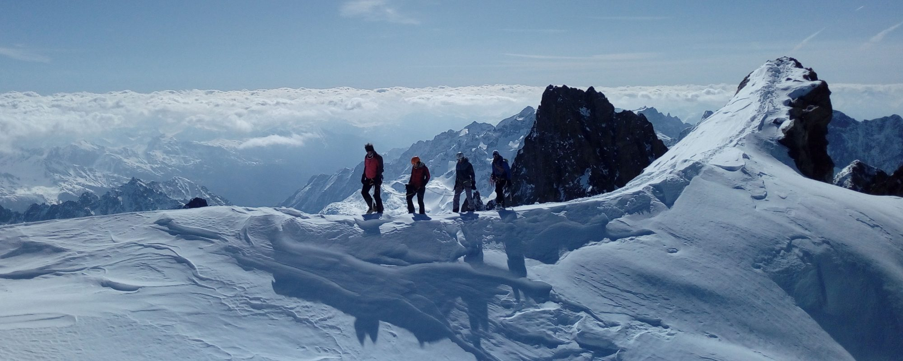

---

title: Créateurs ou dirigeants

question : Pourquoi travailler avec nous sur vos projets de transitions ?

tags:

- line1

parent: Nos actions

color: ee3530

---

Qu’est que vous appelez transition?
-----------------------------------

Le mot transition signifie le passage d’état à un autre et peut, à ce titre, couvrir diverses situations. Pour A𝝻RorA-5R., les projets de transition doivent s’inscrire dans une volonté de développer des solutions et des modèles permettant de progressivement structurer et construire une économie au service du tissu social, de la réalisation des individus et respectueuse de notre environnement. (Lien vers Agir Autrement).

Chaque société a un point de départ différent et un cheminement propre selon sa filière, ses hommes, son historique, ses idées et ambitions … Notre vocation est de les guider et les seconder dans la préparation et l’accomplissement de cette course vers de nouveaux horizons et sommets.

Pourquoi se lancer dans un projet de transition?
------------------------------------------------

Les raisons sous-jacentes au lancement d’un projet de transition sont multiples et propres à chaque société et dirigeant. Néanmoins, elles sont souvent liées à une ou plusieurs faiblesses identifiées de la société, technologique, commerciale ou autre qui entravent son développement, surtout face à des menaces externes liées à des évolutions de marché, de nouvelles attentes clients ou l’apparition d’une nouvelle compétition, couplées à une volonté de répondre aux défis environnementaux et sociétaux de ce siècle.

Un projet de transition a pour double objectif de renforcer la société terme au sein de sa filière et de faire évoluer celle-ci vers des modèles plus résilients et responsables. Il peut prendre différentes formes, lancement de nouveau produit, intégration de solutions numériques dans des solutions existantes, nouveau positionnement dans la chaîne de valeur, transformation du modèle commercial, diversification.

Dans le contexte actuel, il peut être difficile de se projeter et de voir un tel projet comme priorité. Et pourtant, un tel projet permet de mobiliser positivement les énergies, de mettre en action les personnes et la société autour d’un objectif important pour son développement et sa résilience.

AuRorA-5R guide de « transition », vous accompagne tout au long de votre parcours de transition
-----------------------------------------------------------------------------------------------

Les montagnards le savent, chaque course est différente. Quand il s’agit d’atteindre des sommets difficiles et inconnus, faire appel à un guide est souvent un choix judicieux. Ce dernier apporte en effet une vraie valeur ajoutée en:

1. Sélectionnant la course appropriée en fonction des souhaits du chef de cordée et des capacités de la cordée. - c’est ce que nous appelons l’IFA pour Idéation, Faisabilité et Analyse des modèles de valeur.
2. Préparant la course avec la cordée; son tracé, les points d’étapes, les ressources et équipements nécessaires, les itinéraires de repli en cas d’adversité, l’identification des risques éventuels - cette étape est appelée DVP pour Démonstrateur, Validation technique et marché et ¨Plan projet.
3. Guidant la cordée tout au long du cheminement en secondant le chef de cordée et chacun de ses membres en apportant les méthodes, outils et compétences nécessaires tout en anticipant et en apportant les savoir - faire face aux imprévus, quitte à modifier le parcours pour atteindre l’objectif - c’est la phase de réalisation du projet de transition.
4. Célébrant collectivement quand le sommet est atteint.

1ère étape - IFA - Idéation, Faisabilité, Analyse des modèles de valeur
-----------------------------------------------------------------------

La première étape du projet est d’imaginer et valider avec le ou les dirigeants du porteur le ou les courses possibles.

Pour cela, l’équipe d’A𝝻RorA-5R. conduit les travaux suivants:

1. Analyse du positionnement du porteur au sein de la filière
2. Analyse des compétences
3. Idéation, 360°, champ des possibles
4. Analyse de la valeur des solutions ou modèles envisagés
5. Analyse de faisabilité (technique, financements disponibles pour l’étape suivante…)

L’objectif est qu’à la fin de cette étape, le porteur soit en situation de choisir la course dans laquelle il souhaite s’engager.

Temps de réalisation: 1 à 3 mois

Coût estimatif: 10 à 30k€ - financement par le porteur

2ème étape - DVP - Démonstrateur, Validation technique et marché, Plan projet
-----------------------------------------------------------------------------

Une fois la course choisie, cette seconde étape a pour vocation de valider certaines hypothèses et de préparer au mieux le projet.

Pour cela, l’équipe d’A𝝻RorA-5R. conduit les travaux suivants:

1. Réalisation d’un proof of concept (démonstrateur)
2. Validation du potentiel marché selon les différents business models
3. Définition des paramètres techniques, industriels et économiques
4. Réalisation du plan projet
5. Moyens de financements, dépôt et suivi des dossiers pour le financement du projet

A la fin de cette étape, le porteur doit pouvoir décider de s’engager dans la course ou non.

Temps de réalisation: 1 à 3 mois

Coût estimatif: 50 à 100k€ - financement partiel possible

3ème étape - Réalisation du projet
----------------------------------

Cette dernière étape est la réalisation du projet jusqu’à sa mise sur le marché.

Pour cela, l’équipe d’A𝝻RorA-5R., avec l’appui de 𝝻X-ium. et Time4𝝻r-kids. , intervient sur 6 axes:  
Technologique: intégration, optimisation de hardware

1. Numérique: utilisation et intégration de solutions numériques
2. Positionnement: gestion des intermédiaires, accès aux utilisateurs finaux, prescription
3. Modèle commercial: mix produit/service, mix hardware/software, mode de vente (plateforme numérique, direct …)
4. Organisation: compétences à intégrer, méthodes et processus
5. Moyens de financements, dépôt et suivi des dossiers

Temps de réalisation: jusqu’à 24 mois  
Coût estimatif: 100 à 500k€ - financement partiel possible

Pourquoi nous faire confiance ?
-------------------------------

1. De par notre réseau, nos partenaires, et nos partenariats stratégiques avec les centres de recherche de la région, nous faisons collaborer les meilleures expertises professionnelles au sein d’une équipe de jeunes diplômés,
2. Nos méthodes de projets sont itératives, agiles, et réalistes avec des points d’étapes et des retours d’expérience rapides,
3. Notre approche est systémique, couvrant de la conception à la commercialisation, assurant ainsi la cohésion de l’intégralité du projet, et la mobilisation des ressources et compétences adéquates à chaque étape.
4. De par nos statuts et notre forme juridique, notre mission est d’intérêt collectif. Par construction, notre logique n’est pas financière, n'ayant aucun objectif de valorisation pour A𝝻RorA-5R,
5. Nous sommes tiers de confiance tout au long du projet, et nous jouons le rôle d’arbitrage permanent sur le partage de la valeur entre les acteurs de la chaîne de valeur.

Qu’est ce que l’on vous demande comme engagement ?
--------------------------------------------------

S’engager dans un projet de transition avec A𝝻RorA-5R., est différent d’un engagement avec une société d’accompagnement, de conseil ou de prestation. C’est une expérience de la confiance. Nest indispensable que vous soyez conscients et prêts à:

1. Accepter de partager la gouvernance du projet et à fonctionner en transparence avec avec A𝝻RorA-5R.
2. Maintenir une constance dans votre engagement tant que le projet reste dans une zone de possible économique, et dans les périmètres définis dans le contrat avec A𝝻RorA-5R.
3. Financer les actifs industriels et/ou autres actifs nécessaires pour la bonne exécution et opération du projet.
4. Respecter les engagements de résilience et de responsabilité des projets, qui auront été contractualisés.

+> Mettre un lien contactez nous 

