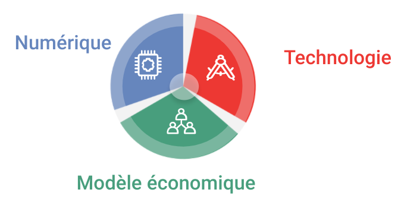

C’est devenu simple et peu coûteux en investissement et en coût de fonctionnement de devenir une entreprise qui utilise les dernières innovations du “numérique”. Certes c’est nouveau, et peu de personne ont les compétences pour activer ces usages en rééls différenciateurs et surtout pour en extraire la valeur. AuRorA a pour mission d’accompagner les PME afin sur leur marché, cette puissance peut créer des avantages compétitifs et ainsi développer durablement de la valeur pour ses clients. 

### C’est en premier lieu une histoire de transition

En aucun cas faire du numérique est suffisant en soit pour générer de l’activité rentable durablement. Une promesse peut suffir à lever des millions pour une start up, mais ce n’est pas ce que nous visons ! 

Pour nous cette transition pour être pertinente demande dans le même temps une transition de business model et parfois une transition technologique métier afin de renforcer ses différenciateurs et les barrières d’entrée de ses concurrents.

### Titre

Lorem ipsum dolor sit amet, consectetur adipiscing elit. Sed non risus. Suspendisse lectus tortor, dignissim sit amet, adipiscing nec, ultricies sed, dolor. Cras elementum ultrices diam. Maecenas ligula massa, varius a, semper congue, euismod non, mi. Proin porttitor, orci nec nonummy molestie, enim est eleifend mi, non fermentum diam nisl sit amet erat

