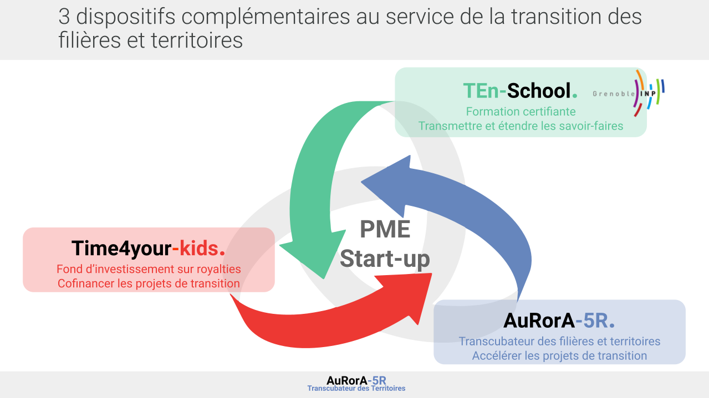

---

title: Agir autrement

question : Pourquoi Travailler avec nous sur vos projets de transition ?

---

Un des moteurs puissants du monde économique actuel, repose sur l’illusion inconsciente que “tout ira mieux” si chacun accumule (de l’argent, des biens, ou encore une identité qui suscite l’envie chez les autres). Cela se décline dans les modèles de marketing et de commercialisation des offres de bien et services actuel (promotion permanentes, simulation de la rareté, …), dans les modèles opératoires industriels qui cherche à maximiser la réduction des coûts (conception en obsolescence programmée jetable à bas coût, supply chain longue mais peu coûteuses, et éthique,...), dans la finance qui dope les bulles spéculatives et favorise la mise à disposition des ressources à ceux qui ont réussi à tenir une position dominante qui réduit les risques sur les investissements. Cela aboutit à une méfiance dans les postures peu collaboratives au sein des écosystèmes et cela afin de maintenir la tension permanente auquel sont soumis les acteurs sur la tenue de leur équation économique dans une économie mondialisée et en pleine mutation technologique.

Sur la base de ce constat, AuRorA-5R propose de construire des environnements sous forme de cercle vertueux afin de partager la valeur autrement au sein des Filières et du territoire afin que chacun puisse agir autrement et ainsi créer des réseaux résilients et responsables dans lesquels les transitions sont vues comme des opportunités, avec le plaisir de vivre la confiance avec les parties prenantes de son écosystème.

Slide sur opérer/collaborrer/ financer/ consomer autrement (V3)

Message de transition au slide suivant : Notre approche est systémique et se veut exemplaire. Afin d’accompagner les projets (PME, ETI ou ideation startup) au sein d’AuRorA-5R, nous collaborons en très forte proximité avec T4YK et la TENSchool pour offrir les financements et permettre aux acteurs économiques porteurs de projets d’embaucher des jeunes diplômés aux compétences adéquates pour mener des transitions de filière sur le territoire. 

Slide sur T4YK / Ten school / AuorA

Message de transition au slide suivant : Cet écosystème permet de développer sans message contradictoire ou de double contraintes des projets 5R 

Slide sur 5R (V3)

Message de transition au slide suivant : Que ce soit pour les projets de PME ou d’idéation, nous suivons un processus en 3 étapes :

Slide sur l’offre et les transitions (V3)

Message de transition au slide suivant : Nous croyons que le monde changera si nous arrivons à créer une nouvelle dynamique dans les filières et en commençant à agir sur le territoire. Nous ne savons pas de quoi sera fait le monde d’après, mais nous sommes certains que c’est en faisant des petits pas en restant aligner sur notre intention et en étant pragmatique avec ce qu’il est possible de faire chaque jour, que nous arriverons à impacter les consciences et à faire émerger le monde de demain. Voici quelques exemples de nos projets et de leur mode d’évaluation. 

Slide sur les exemples (V3)

+> Remettre les boxes jeunes diplômés, entreprise, dirigeants, 

+> Mettre une case : Je veux contribuer (crowdfunding type type for the planet?)

