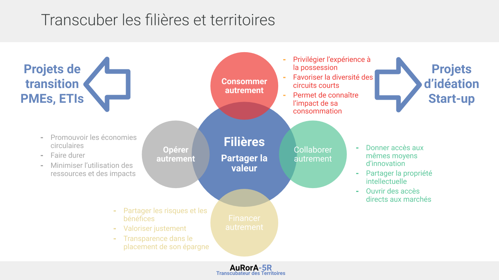
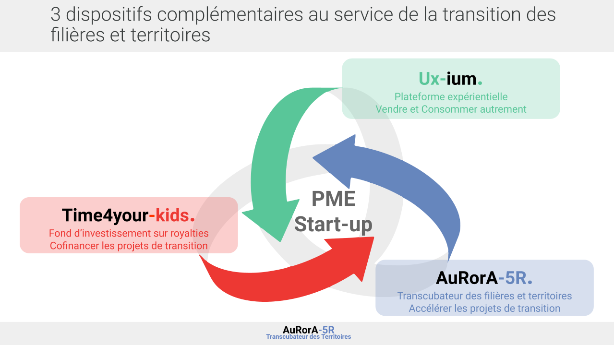
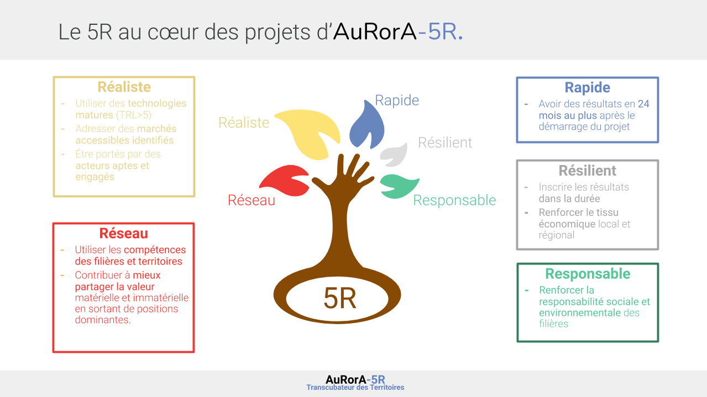
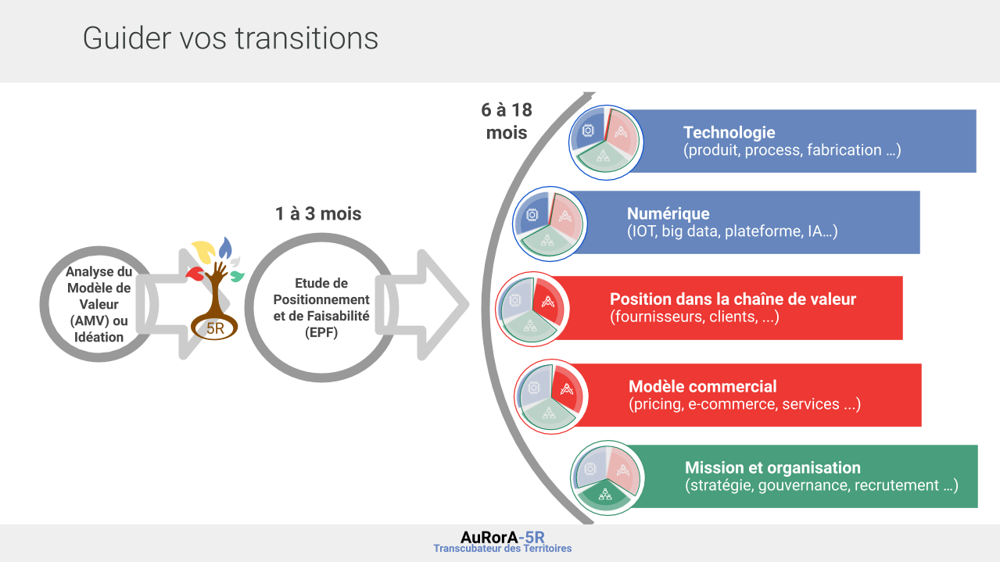
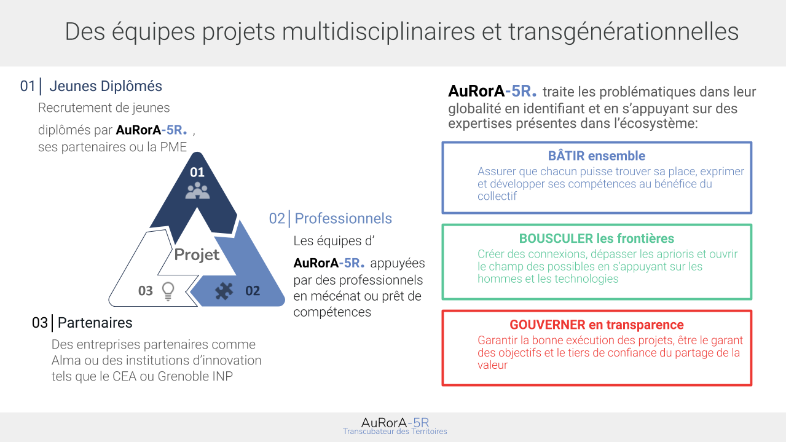
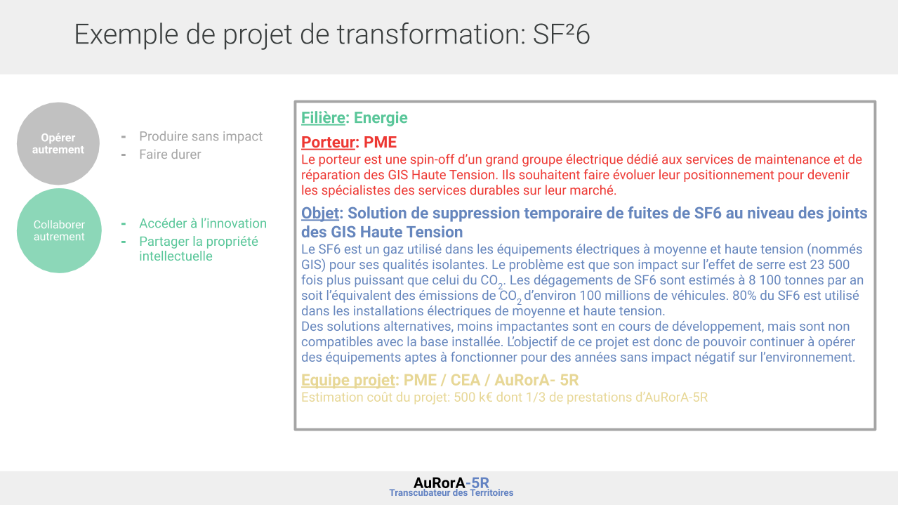
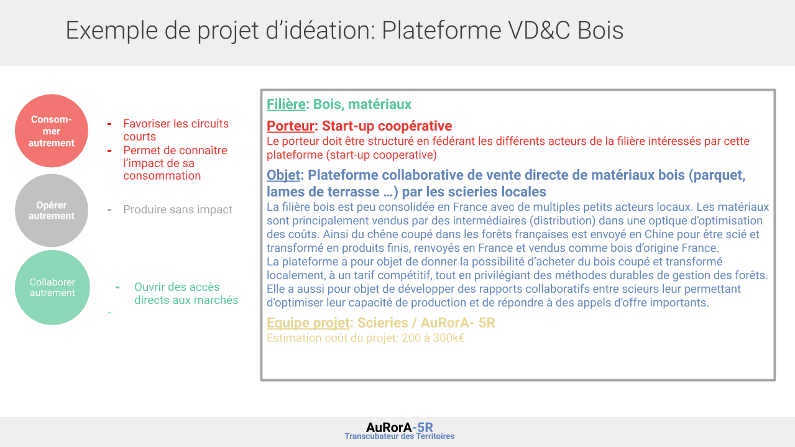

---

title: Agir autrement

question : Pourquoi Travailler avec nous sur vos projets de transition ?

eleventyNavigation:

 key: agir

 title: 'Agir Autrement'

 parent: main

---

Un des moteurs puissants du monde économique actuel, repose sur l’illusion d’une croissance fondée sur l’accumulation (de l’argent, des biens, d’expériences reconnu socialement,..). Cela se décline dans les modèles de marketing et de commercialisation des offres de biens et services actuel (promotion permanentes, simulation de la rareté,stimulation par les réseaux sociaux…), dans les modèles opératoires industriels qui cherche à maximiser la réduction des coûts (conception en obsolescence programmée jetable à bas coût, supply chain longue mais peu coûteuses, et éthique,...), dans la finance qui dope les bulles spéculatives et favorise la mise à disposition des ressources à ceux qui ont réussi à tenir une position dominante, ce qui réduit les risques sur les investissements. De manière indirecte les postures collaboratives ne prennent pas forme au sein des écosystèmes, chaque acteur étant focalisé sur la tenue de leur équation économique dans une économie mondialisée et en pleine mutation.

Sur la base de ce constat, AuRorA-5R propose de construire des environnements sous forme de cercle vertueux afin de partager la valeur autrement au sein des Filières et du territoire afin que chacun puisse agir autrement et ainsi créer des réseaux résilients et responsables dans lesquels les transitions sont vues comme des opportunités, avec le plaisir de vivre la confiance avec les parties prenantes de son écosystème.

Notre approche est systémique et se veut exemplaire. Afin d’accompagner les projets (PME, ETI ou ideation startup) AuRorA-5R, a créé un fond sur royalties pour offrir les financements et permettre aux acteurs de se lancer dans leurs transitions sans prendre le risque de tout perdre, et une plateforme qui permet d’obtenir des accès direct aux marchés pour recréer de nouvelles expérience de consommation. Ces deux piliers associé à l'accompagnement d’AuRorA-5R permet de redonner de l’autonomie dans le développement d’acteurs économiques qui ont pour intention de contribuer à créer un monde cohérent avec leurs intentions.

Cet écosystème permet de développer de supprimer les doubles contraintes qu’impose aujourd’hui le système dans le contexte d’incertitudes économiques, des contraintes écologiques et des transitions à venir. Sur cette base AuRorA-5R accompagne les transitions, en prenant le copilotage de projets 5R.

Que ce soit pour les projets de PME ou d’idéation, nous suivons un processus en 3 étapes, et nous prenons en compte dès le début les différentes transitions auxquelles l’entreprise sera confrontée. 

Nous croyons que le monde changera si nous arrivons à réunir les générations, et à créer une nouvelle dynamique dans les filières et en commençant à agir sur le territoire. Nous ne savons pas de quoi sera fait le monde d’après, mais nous sommes certains que c’est en faisant des petits pas en restant aligner sur notre intention et en étant pragmatique avec ce qu’il est possible de faire chaque jour, que nous arriverons à impacter les consciences et à faire émerger le monde de demain.

Les projets sont co-pilotés avec le porteur de projet et nous agissons en tiers de confiance avec l’ensemble des parties prenantes.. Voici quelques exemples de nos projets et de leur mode d’évaluation.

+> Remettre les boxes jeunes diplômés, entreprise, dirigeants, 

+> Mettre une case : Je veux contribuer (crowdfunding type type for the planet?)

