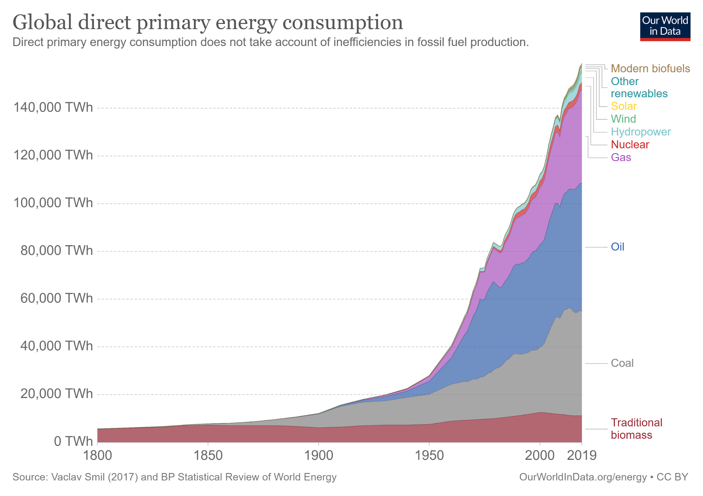
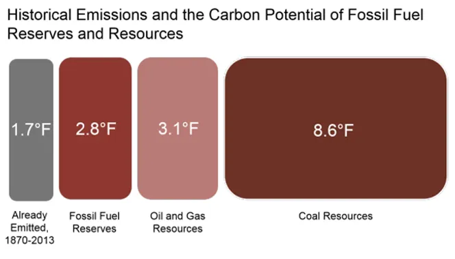
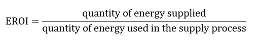
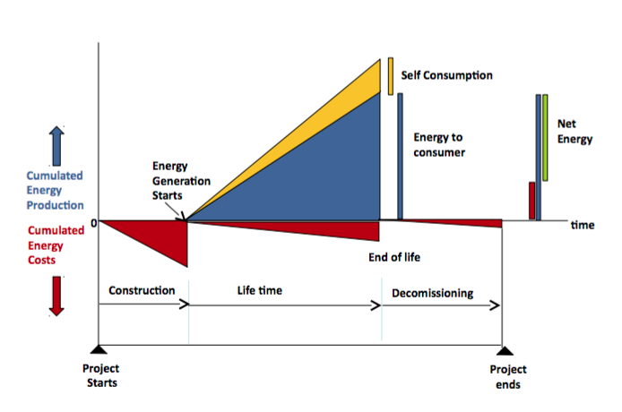
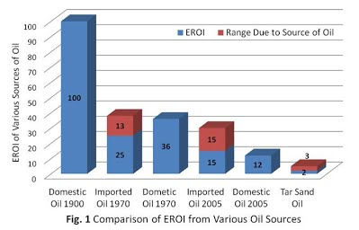
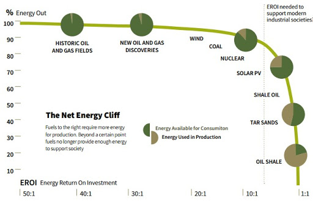
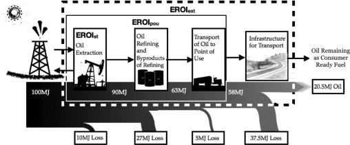

Le challenge
============

L’énergie ne se produit et ne se consomme pas. Elle se capte, se stocke et se transforme. L’énergie que nous absorbons via les aliments est transformée en énergie mécanique, électrique, calorifique ou stockée au sein de nos cellules. Le transfert et la transformation d’énergie sont donc au cœur de la physique de notre univers.

Nous pouvons donc distinguer deux sources d’énergie:

* l’énergie cosmologique, née du Big Bang, que nous parvenons à capter, qui vient principalement du rayonnement solaire (vent, solaire thermique ou photovoltaïque, courants marins…), de la chaleur de la Terre (géothermie … ), ou encore des effets de gravitation de la Lune (marée)
* l’énergie captée et stockée par le vivant, dans lesquelles se rangent les énergies fossiles et biologiques, ou stockée de manière naturelle ou artificielle dans laquelle se range le nucléaire, l’hydrogène ou les batteries.

La disponibilité de l’énergie cosmologique dépend de sa source émettrice. Tant que le Soleil brillera, l’énergie qu’il émettra sera disponible pour être captée. A l’échelle humaine, cette source est donc inépuisable. La limite n’est donc pas dans la source, mais dans les moyens de la capter.

L’énergie stockée, tout comme une batterie, dépend de la capacité de stockage ainsi que de la vitesse de recharge. L’énergie hydraulique est rechargée en quelques mois grâce au cycle de l’eau, via le captage de l’énergie solaire nécessaire à l’évaporation. L’énergie stockée par la biomasse se recharge en quelques jours ou quelques années. La recharge des énergies fossiles, elle, nécessite des millions d’années d’accumulation et de transformation de biomasse.

Quand pendant des siècles, l’homme a utilisé principalement l’énergie captée et stockée par le vivant, avec une recharge rapide, notre civilisation s’est construite sur la découverte et l’utilisation à grande échelle des stocks d’énergie fossiles sous ses différentes formes. Et par effet rebond, notre utilisation énergétique s’est mise à accélérer exponentiellement depuis, avec pour conséquence une décharge rapide de la batterie fossile sur laquelle notre monde est branchée. Sommes-nous à 30% ou 50% de charge? Difficile à dire puisque nous ne connaissons pas exactement la capacité de ce stockage. Néanmoins, nous savons que le stock le plus facile à atteindre est déjà épuisé ou en passe de l’être et que la capacité restante ne dépasse pas quelques dizaines d’années au rythme de notre consommation.

Un second problème se greffe au problème de la décharge de la batterie fossile qui est que le vivant stocke l’énergie principalement par la chimie du carbone. Utiliser cette énergie revient aussi à déstocker ce carbone qui se stocke dans l’atmosphère, augmentant l’effet de serre, avec un changement rapide des conditions climatiques. Le résultat est que vider intégralement la batterie fossile aurait pour conséquence une augmentation dramatique de la température. Des scientifiques ont estimés qu’utiliser les stocks actuellement exploités ajouterait près de 3°C au 1,5°C que nous avons déjà et si nous exploitons l’intégralité des gisements connus (même économiquement non viable), c’est un autre 3°C en plus et si nous ajoutons à cela les réserves de charbon estimées mais non connues, cela pourrait atteindre un total de plus de 16°C !

 

Pour résumer, notre civilisation ne fonctionne que de par son alimentation par une batterie qui se vide rapidement. Elle a de plus l’obligation de s’en déconnecter au plus vite pour éviter les effets néfastes à long terme de son utilisation. Certains pensent qu’il est prioritaire de travailler à supprimer ou réduire cet effet néfaste, ce qui effectivement permettrait de continuer l’exploitation de la batterie fossile jusqu’à son épuisement. Si cela pourrait éventuellement faire gagner quelques années, cela aurait aussi pour conséquence d’accélérer la décharge de la batterie fossile (il faut effectivement beaucoup d’énergie pour remettre le carbone dans le sol), sachant que l’utilisation des stocks restants demandera aussi plus d’énergie pour leur exploitation. Reculer pour mieux sauter en somme, ou comment utiliser une ressource rare pour retarder un peu l’inéluctable.

Nous débrancher de la batterie fossile requiert donc à la fois de capter une grande puissance d’énergie et de pouvoir en stocker tout ou partie, afin d’en permettre l’utilisation en fonction des usages souhaités.

EROI et rendement énergétique
=============================

Une histoire de blé et de pain. Depuis des siècles, l’homme plante du blé pour se nourrir de pain. Sa subsistance est liée à la quantité de pain disponible et indirectement à la quantité de blé produite selon le rendement du processus de transformation du blé en farine puis en pain. La quantité de blé produite dépend du rendement de l’espèce de blé, du lieu, de la nature de la terre et d’autres paramètres qui peuvent se résumer à combien de grains sont produits pour un grain planté.

En énergie, la transformation du blé en pain s’appelle le rendement énergétique tandis que la quantité de grains produite pour un grain planté s’appelle l’EROI.

Comparons 3 processus de production de pain.

* le 1er bénéficie d’une plantation de blé productive puisque pour chaque tonne de grains plantés, sont récoltés 25 tonnes. Le processus de transformation permet d’obtenir 5 tonnes de pain,
* le 2nd a une production plus faible puisque pour chaque tonne plantée, sont récoltés uniquement 8 tonnes. Néanmoins en bout de chaînes, sont obtenus 5,5 tonnes de pain,
* le 3ème a une production de grains identique au 2nd mais un processus qui ne lui permet que d’obtenir 2,5 tonnes de pain.

En regardant l’ensemble de la chaîne, on s’aperçoit que le 1er et 2nd process sont proches alors que le 3ème peut poser un problème pour la subsistance de la population puisqu’il sera nécessaire de doubler la production de grains pour atteindre les mêmes quantités de pain.

Ce même raisonnement s’applique à l’énergie: le 1er est la voiture thermique, le 2nd la voiture électrique alimentée par le couple solaire PV/ batterie et le 3ème la voiture à hydrogène, avec un hydrogène vert fabriqué par une électrolyse de l’eau alimentée par des installations solaires PV.

Le pétrole actuel a un EROI autour de 25 (de 2 à 50 selon l’origine du pétrole) mais un rendement en terme de process d’environ 20%, principalement pénalisé par le faible rendement du moteur thermique (forte déperdition calorifique).

Le solaire PV a un EROI de 8 (de 5 à 10 selon les lieux) mais le couple batterie/moteur électrique donne un rendement de près de 70% alors que le process électrolyse/fuel cell/moteur électrique a un rendement de moins de 30%.

En résumé, plus l’EROI d’une énergie est faible, plus les rendements des processus doivent être élevés.

L’EROI d’une ferme solaire sera calculée en estimant l’énergie captée et mise à disposition pendant les 20 ou 30 ans d’exploitation de l’installation et en la divisant par l’énergie nécessaire pour la production des différents équipements nécessaires (panneaux solaires, structures métalliques, inverters, câbles électriques …), leur installation, leur maintenance et parfois leur déconstruction (ce n’est pas toujours le cas mais peut avoir un impact fort pour certaines sources du type nucléaire). L’EROI dépend donc de multiples facteurs pouvant le faire varier sensiblement pour une même source. Il est à noter que l’efficacité des panneaux solaires (le taux de conversion de l’énergie solaire en énergie électrique) ne rentre pas en compte, l’énergie solaire provenant d’une source considérée comme inépuisable et donc gratuite. 

L’EROI d’une source d’énergie peut varier significativement selon son origine. L’EROI d’une installation solaire au Texas sera plus élevé que la même installation en Angleterre. L’EROI du pétrole ne cesse de chuter, l’exploitation des gisements restants étant de plus en plus énergivore. Le pétrole du début du XXème siècle avait un EROI de 100 alors que les sables bitumineux canadiens varient entre 2 et 5.

L’EROI est donc un moyen d’estimer la quantité d’énergie mise à disposition de la société pour ces différents usages selon l’origine de cette énergie et ce, malgré les variations importantes.

Notre modèle industriel actuel nécessite un EROI minimum de 8 pour fonctionner. Autrement dit, nous pouvons consacrer environ 12% de l’énergie disponible pour aller capter de l’énergie. Au-delà, l’énergie disponible restante ne permet plus de supporter l’intégralité des activités économiques et sociales - c’est ce qui est communément appelé le Net Energy Cliff.

L’EROIst est une notion intéressante mais qui présente certaines limites. La première est que la comparaison entre énergie peut revenir à comparer des choux et des carottes. Tous deux sont des légumes mais avec des caractéristiques et des usages différents. Par exemple, l’EROIst du pétrole est à la sortie des puits d’extraction, il doit donc être transporté, raffiné, stocké avant d’être utilisé. L’EROIst de l’énergie solaire est sous forme électrique donc quasi directement utilisable (si produit sur une toiture) mais sous un format intermittent et non stockable en tant que tel.

D’autres EROI sont donc employés tel que le EROIpou (pour Point Of Usage) ou EROIext (pour Extended) intégrant une plus grande partie de la chaîne énergétique afin de permettre des comparaisons plus pertinentes. Cela peut aller assez loin. Par exemple, comparer l’EROI du train et de l’avion sur un même trajet nécessiterait d’utiliser l’EROIext intégrant le coût énergétique des rails, gares, locomotives, wagon … pour le train et des aéroports, tour de contrôle, avion … pour l’avion.

De l’importance des usages et des rendements
============================================

Le seul intérêt de capter et stocker de l’énergie est de permettre la démultiplication des capacités d’action de l’humanité par l’emploi d’objet et de machines. Soutenir notre modèle économique et social implique donc d’avoir assez d’énergie à disposition pour ces usages.

Savoir si un grain de blé planté produit 5, 10 ou 50 grains de blé n’a d’intérêt que pour déterminer le nombre de grains de blé disponible pour produire du pain. Ce nombre déterminera la capacité de survie d’une famille ainsi que leur qualité de vie. Si la production de grain de blé est de 50:1 mais que la chaîne de transformation pour fabriquer du pain demande un investissement de 5 grains et un rendement de 20%, il ne restera que 10 grains en fin de chaîne avec un nombre de grains investi de 6 et donc un gain net sera de 4. Si la production de grains est de 10:1 mais que la chaîne de transformation coûte un grain de blé avec un rendement de 90%, le résultat est que 9 grains de blé seront disponibles en fin de chaîne pour un coût de 2 et donc un résultat net de 7.

En somme, il est parfaitement possible d’utiliser des énergies avec un EROIst plus faible à condition que leur chaîne de transformation et de transmission jusqu’au point d’usage soit plus optimale et efficace.

Un meilleur ratio EROIpou/EROIst revient à décaler vers la droite le point de bascule sur la courbe du Net Energy Cliff alors qu’un plus mauvais ratio revient à décaler ce point vers la gauche. Notre modèle économique et social peut donc parfaitement subsister sur la base d’énergies primaires présentant EROIst inférieur à 8 à condition que leur EROIpou/EROIst soit plus élevé.

Quelques exemples
=================

La mobilité automobile
----------------------

Énergie investit

Energie utile

Source Primaire Pétrole

EROI ~25

1

25

Transport et raffinage

Rendement 95%

0,2

23,8

Transport et stockage

Perte de 5%

<0,1

22,6

Moteur thermique

Rendement 25%

<0,1

5,6

EROIut thermique se situe autour de 4,3 lié à un faible rendement inférieur à 25% (principalement de par le mauvais rendement des moteurs thermiques). Ce modèle ne fonctionne que de par le faible EROIst de la source primaire qu’est le pétrole. Le modèle devient bien plus problématique avec un pétrole provenent du fracking ou de sables bitumeux avec des EROIst entre 3 et 7.

Énergie investit

Energie utile

Source Primaire  
Solaire PV

EROI ~7

1

7

Transport

Perte 10%

<0,1

6,3

Stockage batterie

Perte 15%

ESOI ~30

~0,2

5,3

Moteur électrique

Rendement 90%

<0,1

4,8

EROIut est d’environ 3,7 grâce à un très bon rendement de 70%, compensant le relativement faible EROIst de la source primaire (ici de 7). 

Énergie investit

Energie utile

Source Primaire   
Solaire PV

EROI ~7

1

7

Electrolyse hydrogène

Rendement 80%

<0,1

5,6

Compression et transport

Perte 15%

<0,1

4,8

Fuel Cell

Rendement 50%

<0,1

2,4

Moteur électrique

Rendement 90%

<0,1

2,2

L’ESOI de la filière hydrogène (electrolyse à la fuel cell) est assez élevée (autour de 60). Néanmoins l’EROIut d’une mobilité fondée sur le couple hydrogène et solaire atteint 1,8 à cause d’un rendement faible de 35%, couplé au faible EROI de la source primaire.

Le bilan énergétique entre une mobilité alimentée par une énergie fossile dont l’EROIst ne cesse de chuter le pétrole et une mobilité électrique combinant solaire et batterie ne cesse de se réduire. Le rendement du cycle hydrogène pénalise cette filière, qui reste néanmoins une solution éventuellement attractive, éventuellement dans une approche hybride batterie et hydrogène, pour parcourir de très longues distances sans possibilité de recharge (aérien, maritime …).

Il est étonnant que l’option combinant recharge et remplacement de batteries ne soit pas plus étudiée par la filière automobile, même si elle accroît les contraintes en termes de design et requiert une standardisation entre les marques. En effet, elle permettrait d’optimiser le bilan énergétique de la filière en:

* offrant des batteries de capacité différente selon la distance à parcourir,
* résolvant le problème du temps de recharge (si le temps de remplacement est court) pour les longs trajets,
* réduire les pics de charge à certains points de forte affluence périodique ou saisonnière

