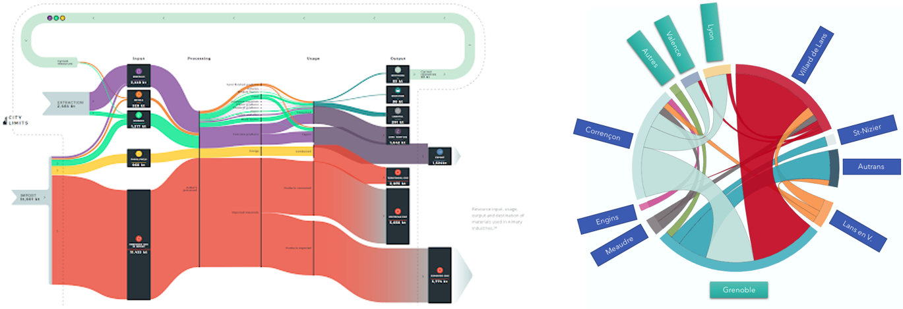
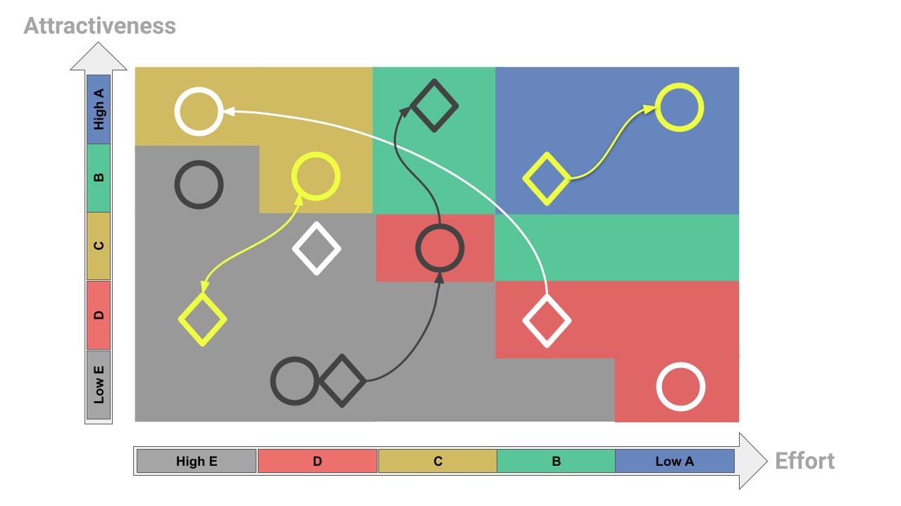

Note méthode M𝝻ze permet d’appréhender la structure d’un marché ou d’une filière en rupture ou en émergence afin d’en comprendre les grandes dynamiques et les variables critiques. Cela permet d’établir différents scénarios, puis d’identifier et de sélectionner avec le porteur les projets de transition les plus pertinents.

Nous sélectionnons un flux pertinent, physique ou non, et modélisons comment il s'intègre au sein de la filière.

Pour cela, nous

1. décomposons la filière en sous-filière pertinente et en phases de process;
2. cartographions les variables, leurs impacts et interactions;
3. établissons divers scénarios en faisant varier l’intensité des interactions et les valeurs d’entrées
4. listons les acteurs ayant une influence sur les variables
5. évaluons votre propre capacité à les influencer

Ce travail permet de bien visualiser et comprendre comment un marché ou une filière opère, ses évolutions possibles et les facteurs conduisant à ce que telle ou telle évolution se produise. Cette approche est d’autant plus structurante que la filière est récente et peu mature, donc propice à des évolutions rapides et brusques, le passé et les tendances du présent ne reflétant alors pas forcément ce que sera le futur.

Un tableau de synthèse est proposé permettant de sélectionner les sous-branches et/ou phases de process semblant les plus pertinentes. Des études complémentaires sont menées sur cette sélection incluant:

1. les différentes technologies et solutions envisageables et leur degré de maturité;
2. la chaîne de valeur et leurs acteurs critiques;
3. les compétiteurs présents et éventuellement futures;
4. le dimensionnement du marché accessible

En parallèle, nous réalisons des séances d’idéation avec vos équipes permettant de:

1. proposer différents positionnement et business models;
2. imaginer diverses solutions techniques;
3. évaluer les efforts nécessaires (investissement, ressources …) pour atteindre ces positionnements ou développer ces solutions;
4. les interactions éventuelles entre les positionnements et les solutions

Nous notons les différents projets envisageables (positionnement ou solution) sur leur attractivité et l’effort nécessaire . Nous établissons un graphique de synthèse appuyant visuellement la priorisation et la sélection du ou des projets de transition à lancer.

Temps de réalisation: 2 à 6 mois selon la complexité de la filière

