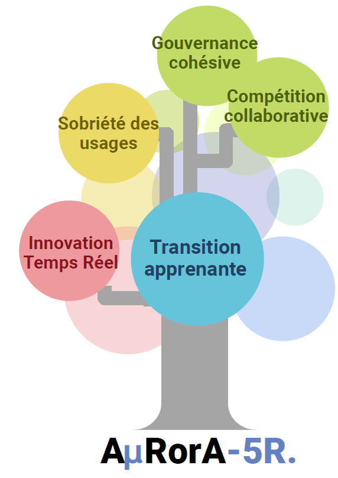
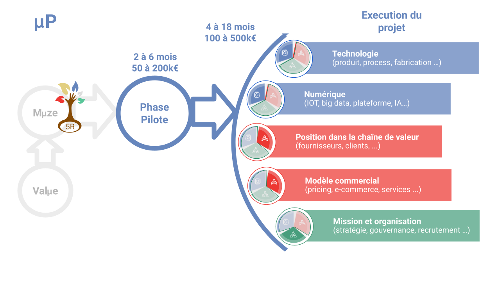

Phase pilote
------------

Ça y est, vous avez pris votre décision et êtes fixés sur le projet de transition dans lequel vous voulez vous investir. Malgré tout le soin apporté aux phases amont, il est indispensable de valider les hypothèses faites, les concepts proposés et de planifier l'exécution du projet, avant de mobiliser l’intégralité des ressources et des investissements.

Pour cela, l’équipe d’A𝝻RorA-5R. conduit, avec vos équipes, une phase pilote essentielle contenant:

1. la réalisation d’un ou plusieurs pilotes (proof of concept ou démonstrateur);
2. le retour client / utilisateur permettant d’affiner le potentiel marché et les différents business models;
3. la validation des paramètres techniques, industriels et économiques;
4. la définition du plan projet;
5. la mobilisation des moyens de financements pouvant supporter le projet avec le dépôt et suivi des dossiers associés.

A la fin de cette étape, vous disposez d’un ultime point d’étape avant de vous engager dans l’exécution du projet, avec les investissements associés.

Temps de réalisation: 2 à 6 mois selon la nature des pilotes choisis

Réalisation et déploiement du projet
------------------------------------

Dans cette dernière étape nous vous accompagnons dans la réalisation du projet jusqu’à sa mise en œuvre, souvent synonyme de commercialisation.

Notre méthode de gestion de projet s’éloigne des standards du management de projet classique de type PMI (même si nous en utilisons certains outils) pour privilégier une approche itérative dynamique sur la base de réalisation de prototypes et d’essais et d’une forte parallélisation des tâches, permettant un apprentissage permanent et l’adoption de solutions pragmatiques. Le projet est géré par un cercle de management principal et décomposé en différents modules gérés par leur propres cercles, avec des délégations claires et reportant quasi quotidiennement au cercle principal dans un mode agile. Le mode de décision est fondé sur le consentement, ce qui assure la fluidité du système.

Nos équipes interviennent sur 6 axes principaux :

1. Technologique: intégration, optimisation de hardware
2. Numérique: utilisation et intégration de solutions numériques
3. Positionnement: gestion des intermédiaires, accès aux utilisateurs finaux, prescription
4. Modèle commercial: mix produit/service, mix hardware/software, mode de vente (plateforme numérique, direct …)
5. Organisation: compétences à intégrer, méthodes et processus
6. Moyens de financements, dépôt et suivi des dossiers

Temps de réalisation: jusqu’à 18 mois selon la complexité du projet

Pour en savoir plus, n’hésitez pas à nous [contacter](https://aurora-5r.fr/pages/Contact)

 

