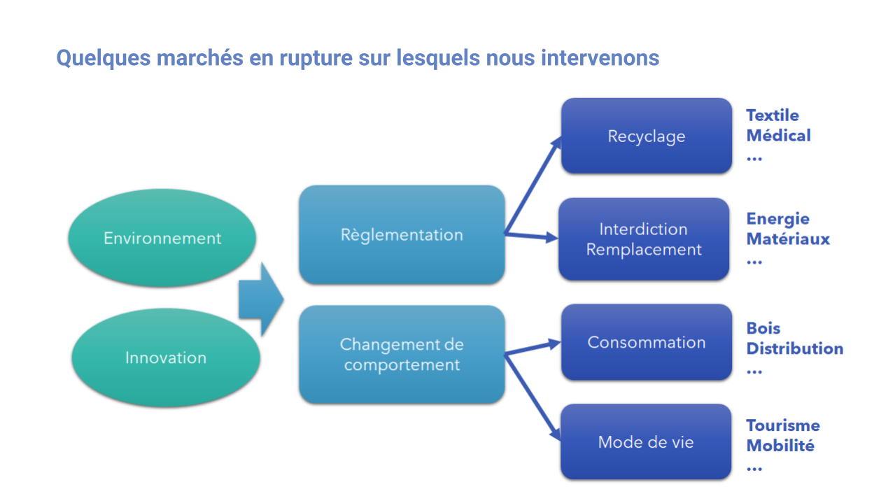

---
gsuiteid: 1u625_qkZtAz05DEK__YhYpGkI9sPO3mX42TTp_xDiug
title: Créateurs et dirigeants

subtitle: Comment et pourquoi collaborer avec nous ?

tags:

- line1

parent: Nos actions

color: yellow

topboxes: offres

--- 

Comment répondre aux incertitudes des marchés en rupture ?
----------------------------------------------------------

La vie d’une entreprise est jalonnée par des ruptures de plus en plus fréquentes de part les innovations technologiques et les impacts environnementaux, ce qui l’expose à des incertitudes importantes; évolution des réglementations, mutation des comportements, changement de marché… .

Les équipes d’A𝝻RorA-5R. vous accompagnent pour appréhender les dynamiques de ces marchés en rupture et pour construire ensemble des réponses appropriées selon votre contexte et historique. L’incertitude liée à ces ruptures est souvent vécue comme un vecteur de menaces, nous en faisons une source d’opportunités, conjuguant renforcement de la performance de l’entreprise et de son écosystème avec sa résilience et sa responsabilité sociale et environnementale.

Nos solutions d’accompagnement sont:

* l’évaluation de votre exposition à des changements de votre environnement économique et de votre aptitude à y répondre, ([Xpos𝝻](https://www.google.com/url?q=https://aurora-5r.fr/offres/Xposr/&sa=D&source=editors&ust=1622280666288000&usg=AOvVaw2R10wyfV0kQhNYOpIY_2he)r)
* l’analyse de votre positionnement dynamique sur des marchés en devenir, ([M𝝻ZE](https://www.google.com/url?q=https://aurora-5r.fr/offres/Mze/&sa=D&source=editors&ust=1622280666289000&usg=AOvVaw17TG_Sblgii7hDuHDoha1d))
* le lancement d’une innovation, modèle ou nouveau produit, ([𝝻](https://www.google.com/url?q=https://aurora-5r.fr/offres/P/&sa=D&source=editors&ust=1622280666289000&usg=AOvVaw2hxucClUxj1FIBOenQTuy4)[P](https://www.google.com/url?q=https://aurora-5r.fr/offres/P/&sa=D&source=editors&ust=1622280666289000&usg=AOvVaw2hxucClUxj1FIBOenQTuy4))
* la refonte de votre proposition de valeur autour de l’expérience ([𝝻X-ium](https://www.google.com/url?q=https://aurora-5r.fr/offres/Xium/&sa=D&source=editors&ust=1622280666289000&usg=AOvVaw1U11-OmM6ui4XJSdyRh40F))

Nous travaillons déjà avec des acteurs des filières décrites dans le schéma ci-dessous. Nous prenons aussi l’initiative sur des filières dans lesquelles les transitions nous semblent inévitables pour la prochaine décennie. Ainsi, nous en saisissons les enjeux et les modèles émergents qui offrent des opportunités de positionnement.

Pourquoi nous faire confiance ?
-------------------------------

Nous pourrions lister nos multiples expériences et références, vous dire que nous maîtrisons l’industrie 4.0, la supply chain 2.0, le big data et l’AI, la gestion de projets d’innovation complexes et leur financement … Certes, si tout cela revêt une certaine importance, les raisons de nous faire confiance sont autres:

* Nous savons que nous ignorons nombre de choses. C’est pourquoi nous allons chercher les meilleures expertises auprès de nos entreprises et centres de recherche partenaires en fonction des besoins de chaque projet, en complément de vos équipes.
* Nous aimons travailler avec vous mais espérons que vous pourrez rapidement vous passer de nous. Aussi, vous êtes pleinement libres de recruter les jeunes diplômés, employés d’A𝝻RorA-5R., pour poursuivre l’aventure au sein de vos équipes. Nous vous le recommandons et vous y aidons.
* Nos objectifs propres ne sont pas économiques. Certes, nous aimerions être payés pour le travail effectué mais c’est uniquement pour pouvoir continuer notre mission et faire bénéficier le maximum d’entreprises de notre approche. En effet, [nos statuts](https://www.google.com/url?q=https://drive.google.com/file/d/17FEBHRKYNJvYjrOQzsJoRbZ8iE95zt6h/view?usp%3Dsharing&sa=D&source=editors&ust=1622280666291000&usg=AOvVaw1JQOSksgcrADbJIEkHjTnq) et notre forme administrative de SCIC ne permettent pas une valorisation financière des parts sociales et limitent très fortement leur rémunération. Conformément à notre attachement à un partage équilibré de la valeur, nous tenons à ce qu’un maximum de cette valeur bénéficie aux acteurs économiques des filières et des territoires engagés dans une transition résiliente et responsable.
* Nous apprécions traiter des problèmes pas toujours bien identifiés, sujet à diverses injonctions contradictoires et offrant de multiples voies de résolution. Aussi, préférons-nous construire avec vous plutôt que de répondre à des cahiers des charges aussi bien conçus qu’ils soient, même si nous savons aussi le faire.
* Nos principales valeurs sont l’écoute, la confiance et le discours de vérité. Nous devons reconnaître que travailler avec nous n’est pas toujours un long fleuve tranquille. En effet, nous partageons le positif comme le négatif, et n’hésitons pas à exprimer notre point de vue même si cela ne plaît pas toujours. Au-delà de la réalisation d’un projet, soyez prêt à vivre une véritable expérience humaine et apprenante. 

Pour en savoir plus, n’hésitez pas à nous [contacter](https://aurora-5r.fr/pages/Contact)

