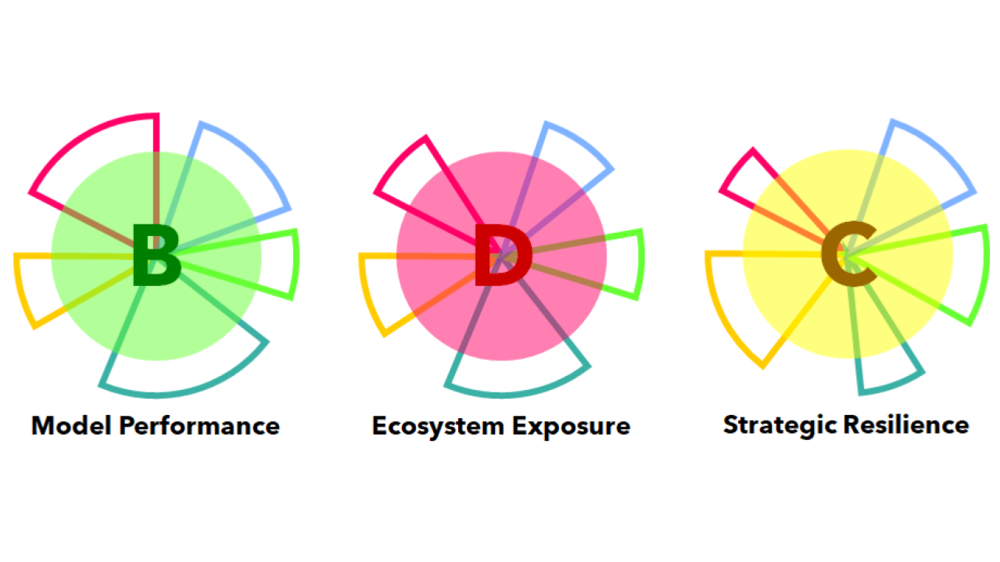

De nombreux outils et sociétés permettent aux entreprises de mesurer et de suivre leur performance, qui est généralement économique et financière. Piloter cette performance est certes un élément nécessaire mais pas suffisant, parce que lié à un contexte et un environnement donné.

 

Notre offre Val𝝻e est une méthode développée par A𝝻RorA-5R. permettant au-travers d’un système de scoring de mesurer rapidement la performance du modèle de l’entreprise dans sa chaîne de valeur (Model Performance), l’intensité des évolutions éventuelles de son écosystème (Ecosystem Exposure) et sa capacité d’adaptation à ces changements (Strategic Resilience).

L’objectif n’est pas d’avoir une mesure parfaite mais une vision synthétique de la situation de l’entreprise ou du territoire, de ses points forts et faibles, afin de pouvoir déterminer les axes de transition les plus importants et pertinents à considérer.

La méthode Val𝝻e démarre par un questionnaire, suivi d’une première session d’une demi ou une journée sur site, puis d’une session de restitution, de partage des résultats et d’approfondissement pendant laquelle seront identifiées les perspectives possibles de transitions.

Temps de réalisation: 2 à 3 semaines

Coût estimatif: 2 à 5k€

