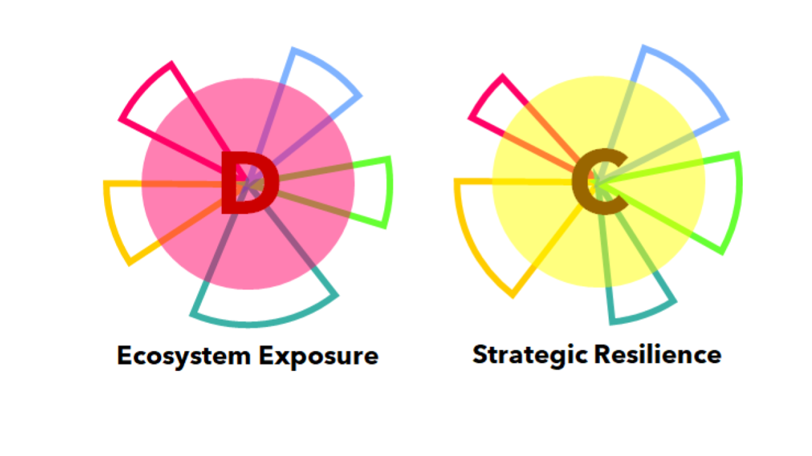

Notre méthode s’appuie sur un outil développée par A𝝻RorA-5R. permettant au-travers d’un système de scoring de mesurer rapidement l’intensité des évolutions éventuelles de son écosystème (Exposition) et sa capacité d’adaptation à ces changements (Resilience).

L’objectif de cet outil n’est pas d’avoir une mesure parfaite mais une vision synthétique de la situation de l’entreprise, de ses points forts et faibles, afin d’aider à déterminer les axes de transition les plus importants et pertinents à considérer.

Nous mettons gratuitement cet outil à disposition des entreprises pour qu’elles puissent faire leur auto-évaluation d’une manière totalement anonyme.

L’analyse de résilience et d’exposition Xpos𝝻r a pour vocation:

* d’aider les dirigeants à mieux évaluer la capacité de leur société à faire face à un changement d’environnement économique et la probabilité qu’un tel changement se produise.
* de déterminer des pistes de travail permettant de répondre ou de tirer avantage à ces changements

Elle est conduite en 4 temps:

* Il est demandé à différentes personnes de l’entreprise de remplir l’outil Xpos𝝻r 
* Une journée d’échanges et questions/réponses organisée sur site
* Une phase d’approfondissement de l’analyse et de formalisation des pistes
* Une restitution de l’analyse avec un échange sur les pistes envisagées et leur mise en oeuvre

Temps de réalisation: 2 à 3 semaines  
Possibilité de session de suivi (½ journée) additionnelle et éventuellement répétitive.

