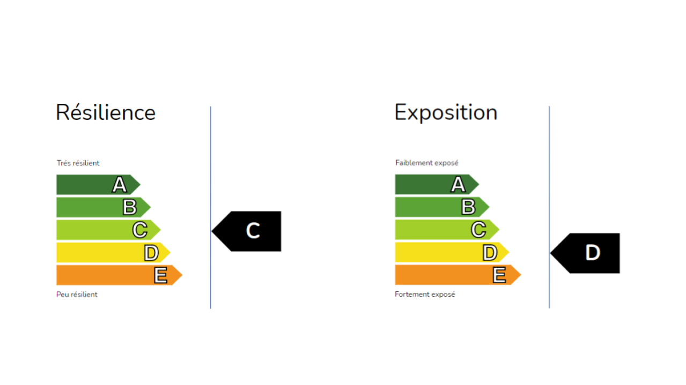

Notre monde est traversé par 2 grands courants transformatifs concomitants: le numérique et la réduction de notre impact environnemental à un niveau durable. Ensemble, ils bouleversent des pans entiers de l’économie de par la magnitude et la vélocité des transitions qu’ils alimentent.

Comprendre l’impact de ces 2 courants sur l’environnement d’une entreprise doit être au cœur de toute stratégie parce que déterminante dans sa capacité d’adaptation et de développement futur, et englobant toutes les fonctions, de l’industrialisation au commerce ou aux ressources humaines.

A𝝻RorA-5R. vous aide à mieux appréhender ces impacts sur votre environnement ainsi que vos forces et faiblesses pour y répondre. Notre méthode s’appuie en premier lieu, sur un outil, permettant au-travers d’un système de scoring de mesurer rapidement l’intensité des évolutions éventuelles de votre écosystème (Exposition) et votre capacité d’adaptation à ces changements (Resilience).

L’objectif de cet outil n’est pas d’avoir une mesure parfaite mais une vision synthétique de la situation de l’entreprise, de ses points forts et faibles, afin d’aider à déterminer les axes de transition les plus importants et pertinents à considérer.

Nous mettons gratuitement cet outil à disposition des entreprises pour qu’elles puissent faire leur auto-évaluation d’une manière totalement anonyme.

L’objectif de cette phase est :

* d’appréhender la probabilité et la nature des changements et opportunités auxquels l’entreprise pourrait faire face dans les prochaines années
* d’aider les dirigeants à mieux évaluer la capacité de leur société à faire face à ces changements.
* de déterminer des pistes de transition permettant de répondre à ces changements

Elle est conduite en 4 temps:

* Il est demandé à différentes personnes de l’entreprise de remplir l’outil Y𝝻 
* Une journée d’échanges et questions/réponses organisée sur site
* Une phase d’approfondissement de l’analyse et de formalisation des pistes
* Une restitution de l’analyse avec un échange sur les pistes envisagées et leur mise en oeuvre

Temps de réalisation: 2 à 3 semaines  
Possibilité de session de suivi (½ journée) additionnelle et éventuellement répétitive.

