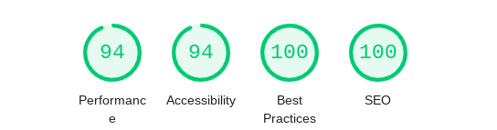

Nous venons de mettre en ligne la nouvelle version du site web de aurora-5r.fr qui est déjà la troisième version.

Sur le fond, nous avons repris l’ensemble des textes pour mieux expliquer qui nous sommes, nos objectifs, nos offres.

Sur la forme, ce site est pour nous un laboratoire d’application du numérique responsable et inclusif que nous prônons.

Un site léger et performant.
----------------------------

En utilisant le générateur de site [eleventy](https://www.google.com/url?q=https://www.11ty.dev/&sa=D&source=editors&ust=1615285851899000&usg=AOvVaw3EQv7e_hGnHx6nWn4xsen5) le site est léger et peu gourmand en puissance machine (sans base de données en particulier).

La collaboration et la mise à jour facile avant tout.
-----------------------------------------------------

Un de nos objectifs est que le site soit mis à jour en permanence en lien direct avec la documentation que nous produisons. Nous utilisons les outils de collaboration Google Suite qui nous permettent de produire ensemble ces documents. Nous avons développé un outil ( [GsuiteToMd](https://www.google.com/url?q=https://pypi.org/project/GsuiteToMd/1.0/&sa=D&source=editors&ust=1615285851900000&usg=AOvVaw0lHqXTOEEbynWIecGh89ml) ) qui convertit directement ces documents au format markdown compréhensible par eleventy, notre site est ainsi mis à jour directement sans manipulations techniques.

Un score “lighthouse” tout vert !
---------------------------------

[Lighthouse](https://www.google.com/url?q=https://developers.google.com/web/tools/lighthouse&sa=D&source=editors&ust=1615285851901000&usg=AOvVaw3PnxhrfzUHLw7aEzVkfHFC) est un outil d’audit des performances des sites web qui donne une note sur 100 selon 4 axes, et le résultat est au rendez-vous.

