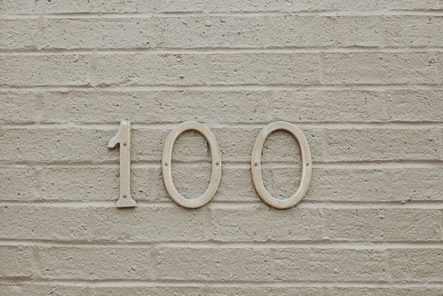

Voilà, cela fait 100 jours que AuRorA-5R a vu le jour.   
100 jours qui se sont écoulés étrangement à la fois rapidement et doucement, pris dans cette étrange période de semi-confinement permanent où chaque jour a tendance à ressembler au précédent, et qui donne une belle place aux questions essentielles autour de ce que nous voulons et pouvons apporter.

Quand nous regardons derrière nous, que voyons-nous?

Tout d’abord, nous avons gagné en maturité sur notre stratégie et sur nos offres avec un positionnement plus clair sur 2 axes; comprendre et se positionner dans des marchés émergents ou en rupture d’une part, et développer une solution de marque numérique et de e-commerce permettant de remettre l’expérience client au cœur du processus d’achat d’autre part.   
Notre site web a bien évolué et correspond à ce que nous voulons mettre en œuvre avec nos premiers outils et solutions numériques simples, durables et inclusifs.   
Nous avons conclu notre premier contrat avec un client dans la filière textile autour du recyclage et progressons sur d’autres sujets dans le médical, l’énergie et la mobilité.   
Nous avons ouvert 2 postes, un de développeur et un de modélisation de marchés. 

Chaque pas compte et nous en avons fait de nombreux en 100 jours.   
Bien sûr et comme nous devions nous y attendre, nous avons eu aussi notre lot de difficultés à surmonter. 

La vague d’enthousiasme autour du monde d’après (quoique cela pouvait vouloir dire) qu’avait suscité la stupeur du premier confinement, n’a pas résisté au second et à la longue période de semi-confinement qui a suivi.   
Les tribunes demandant de saisir l’opportunité de cette crise pour initier la transition vers un modèle plus durable et équitable, répondant aux enjeux environnementaux et sociaux de ce siècle, ont disparu au profit d’un grand appel pour un retour au plus vite du monde d’avant. Et pourtant les sous-jacents à la nécessité de repenser nos modèles industriels et économiques restent plus que jamais vrais. 

Certes, cela limite la vitesse de notre croissance par la moindre sensibilité des acteurs économiques à cette problématique, mais cela nous enjoint de travailler encore plus ardemment à construire la confiance nécessaire pour se lancer dans l’aventure des transitions.

A cela s'ajoutent des difficultés quant à l’accès à nos clients potentiels. Difficile dans un monde où tout est virtuel de se faire connaître, de créer des liens humains et de prospecter. Reste les réseaux personnels et le bouche à oreilles mais qui ne permettent pas de sensibiliser à plus grande échelle, surtout pour une proposition de valeur aussi spécifique. Et comme tous les entrepreneurs le savent bien, une offre doit trouver son marché pour exister. Après 100 jours, nous espérions avoir plus de contacts et de prospects pour pouvoir expérimenter bien plus vite et à une bien plus grande dimension de nouveaux modèles plus vertueux. Nous espérions être dans la situation d’embaucher plus de jeunes diplômés afin de leur permettre d’entrer positivement dans leur vie professionnelle, ce qui est un pilier fondateur d’AuRorA-5R.

La création d’entreprise est rarement un fleuve tranquille. Nous le savions en nous lançant dans cette aventure. 

Les retours sur le modèle d’AuRorA-5R sont souvent très positifs, nous confortant dans l’exploration de cette voie. L’équipe est motivée et soudée et travaille pour faire des projets actuellement identifiés des succès et des références, pour montrer qu’il est possible de de développer et de réaliser ensemble une transition vers des modèles durables, efficaces et vertueux, qui paraîtront, nous le croyons, comme une évidence dans une dizaine d’années.

Les 100 prochains jours, et les 100 suivants, seront tout aussi importants, voire plus que les 100 déjà écoulés parce qu’ils seront ceux des premiers résultats sur lesquels le développement de l’entreprise se fera.

[Luis Morera](https://www.google.com/url?q=https://unsplash.com/@luismorerat?utm_source%3Dunsplash%26utm_medium%3Dreferral%26utm_content%3DcreditCopyText&sa=D&source=editors&ust=1625589930955000&usg=AOvVaw20I5c54FD7qSdavIdkU5ZT) on[Unsplash](https://www.google.com/url?q=https://unsplash.com/s/photos/100?utm_source%3Dunsplash%26utm_medium%3Dreferral%26utm_content%3DcreditCopyText&sa=D&source=editors&ust=1625589930956000&usg=AOvVaw0JoctbxzETUAtUmHhWmXQ6)

